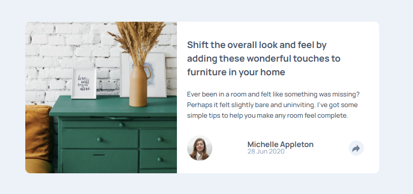
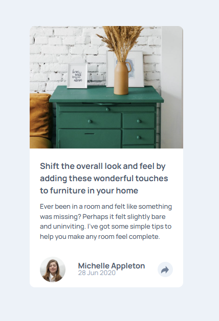

## Table of contents

- [Overview](#overview)
  - [Usage](#usage)
  - [Screenshot](#screenshot)
  - [Links](#links)
- [My process](#my-process)
  - [Built with](#built-with)
  - [Highlights](#highlights)
  - [Useful resources](#useful-resources)
- [Author](#author)


## Overview

### Usage

Users should be able to:

- View the optimal layout for the component depending on their device's screen size
- See the social media share links when they click the share icon


### Screenshot





### Links

- Solution URL: [Github Repository](https://github.com/SteveNoyes/preview-window)
- Live Site URL: [Github Pages](https://stevenoyes.github.io/preview-window/)


## My process

### Built with

- Mobile-first workflow
- Semantic HTML5 markup
- CSS custom properties
- Flexbox


### Highlights

```html
  <div class="triangle-down" style="display: none;"></div>
```

```css
  .triangle-down {
    display: inline;
    width: 0;
    height: 0;
    border-left: 15px solid transparent;
    border-right: 15px solid transparent;
    border-top: 20px solid var(--very-dary-grayish-blue);
    position: relative;
    top: -45px;
    left: 63px;
  }
```

```js
  var windowWidth = window.matchMedia("(max-width: 750px)")
```


### Useful resources

- [The Markdown Guide](https://www.markdownguide.org/) to learn more.

- [Center a Div](https://www.geeksforgeeks.org/how-to-align-a-div-element-to-the-middle-of-a-page-using-css/) - I have googled this more than I would care to admit.

- [Change SVG Color](https://nucleoapp.com/blog/post/change-svg-color-css) - Changing the color of the share icon SVG.

- [Media Queries in Javascript](https://www.w3schools.com/howto/howto_js_media_queries.asp) - Applying different JavaScript based on viewport width.

## Author

- Website - [Steven Noyes](https://www.stevenmnoyes.com)